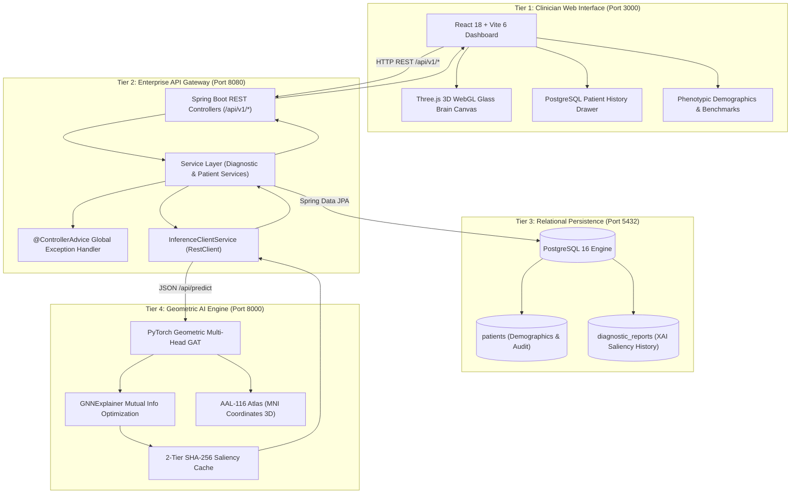

<div align="center">

# 🧠 NeuroGraph-ASD
### Explainable Multimodal Geometric Deep Learning & 3D Connectomics for Autism Spectrum Disorder Screening

[](https://adoptium.net/)
[](https://spring.io/projects/spring-boot)
[](https://reactjs.org/)
[](https://vitejs.dev/)
[](https://pytorch.org/)
[](https://pyg.org/)
[](https://www.postgresql.org/)
[](https://threejs.org/)
[](LICENSE)
[](.github/workflows/ci.yml)

<p align="center">
  <b>An end-to-end clinical decision-support framework fusing resting-state fMRI (rs-fMRI) functional connectomes with phenotypic patient profiles using Graph Attention Networks (GAT), GNNExplainer neuro-biomarker saliency, and interactive 3D WebGL glass brain rendering.</b>
</p>

[Key Features](#-key-features) •
[Architecture](#-enterprise-4-tier-architecture) •
[Mathematical Foundations](#-mathematical--geometric-deep-learning-pipeline) •
[Quick Start](#-quick-start-guide) •
[API Documentation](#-rest-api-specification) •
[Citation](#-citation)

---

</div>

## 📌 Clinical Overview & Motivation

Autism Spectrum Disorder (ASD) is a complex neurodevelopmental condition characterized by heterogeneous alterations in whole-brain functional connectivity. Traditional neuroimaging diagnostic workflows rely on manual visual inspection or static thresholding, which are vulnerable to diagnostic delays and subjective bias.

**NeuroGraph-ASD** introduces a robust, 4-tier enterprise clinical platform that:
1. Translates 4D blood-oxygen-level-dependent (BOLD) resting-state fMRI time-series into topological brain graphs using the **AAL-116 Atlas Parcellation**.
2. Applies **Multi-Head Graph Attention Networks (GAT)** to capture non-Euclidean functional synchrony alterations while simultaneously conditioning on patient phenotypic demographics (Age, Biological Sex, Full-Scale IQ).
3. Leverages **GNNExplainer** to optimize mutual information edge masks, generating verifiable, clinician-interpretable neural circuits within the **Default Mode Network (DMN)** and **Salience Network**.
4. Delivers an interactive **Three.js 3D WebGL Glass Brain** with orthographic multi-planar views and a persistent **PostgreSQL** patient history registry.

---

## 🏛️ Enterprise 4-Tier Architecture



---

## ✨ Key Features

* **🧠 Automated AAL-116 Brain Parcellation:** Computes $116 \times 116$ Pearson correlation matrices with **Fisher $r$-to-$z$ transformations** across 13,456 anatomical connectivity pairs.
* **⚡ Multimodal Graph Attention Networks (GAT):** Dual-branch architecture fusing graph geometric embeddings with phenotypic multi-layer perceptron (MLP) representations.
* **🔍 Clinician-Centric Explainable AI (XAI):** Mathematically isolates critical biomarker subgraphs to reveal under-connectivity and hyper-synchrony patterns.
* **🌐 Three.js 3D WebGL Glass Brain:** Real-time 3D rotation, zooming, ROI raycasting, and orthographic axial/sagittal/coronal projections.
* **☕ Enterprise Spring Boot 3 Gateway:** Strict Layered Architecture (`Controller` $\rightarrow$ `Service` $\rightarrow$ `Repository`), `@RequiredArgsConstructor` constructor injection, `@Slf4j` verbose logging, and `@ControllerAdvice` global error handling.
* **🐘 PostgreSQL Clinical Persistence:** Stores registered patient profiles, historical diagnostic decisions, and temporal XAI JSON pathways with zero data loss.
* **🔄 Seamless Local Fallback:** Automatically operates with embedded in-memory H2 database and dynamic phenotypic engine if external microservices are offline.

---

## 🔬 Mathematical & Geometric Deep Learning Pipeline

### 1. Functional Connectivity & Fisher $r$-to-$z$ Transform
Given BOLD time-series signals $\mathbf{X}_i, \mathbf{X}_j \in \mathbb{R}^T$ for brain regions $i$ and $j$:

$$r_{ij} = \frac{\sum_{t=1}^T (X_{i,t} - \bar{X}_i)(X_{j,t} - \bar{X}_j)}{\sqrt{\sum_{t=1}^T (X_{i,t} - \bar{X}_i)^2} \sqrt{\sum_{t=1}^T (X_{j,t} - \bar{X}_j)^2}}$$

$$z_{ij} = \frac{1}{2} \ln \left( \frac{1 + r_{ij}}{1 - r_{ij}} \right)$$

### 2. Multi-Head Graph Attention Layer
Attention coefficients $\alpha_{ij}^k$ for attention head $k$ are computed as:

$$\alpha_{ij}^k = \frac{\exp\left(\text{LeakyReLU}\left(\mathbf{a}_k^T [\mathbf{W}_k \mathbf{h}_i \,\|\, \mathbf{W}_k \mathbf{h}_j]\right)\right)}{\sum_{l \in \mathcal{N}_i} \exp\left(\text{LeakyReLU}\left(\mathbf{a}_k^T [\mathbf{W}_k \mathbf{h}_i \,\|\, \mathbf{W}_k \mathbf{h}_l]\right)\right)}$$

### 3. GNNExplainer Mutual Information Optimization
To identify the most salient explanatory subgraph $G_s$, GNNExplainer maximizes mutual information (MI):

$$\max_{G_s} \text{MI}(Y, G_s) = H(Y) - H(Y \mid G = G_s)$$

---

## 🚀 Quick Start Guide

### Prerequisites
* **Java:** JDK 17+ (Eclipse Temurin recommended)
* **Node.js:** Node.js 18+ & npm
* **Python:** Python 3.11+
* **Maven:** Apache Maven 3.9+ (or use included wrapper)

---

### Option A: Local Development (1-Command Launcher)

Run the included PowerShell dev orchestrator:

```powershell
.\dev.ps1
```

Access the interfaces:
* 💻 **React 18 Clinician Dashboard:** [http://localhost:3000](http://localhost:3000)
* ☕ **Spring Boot 3 API Gateway:** [http://localhost:8080/api/v1/health](http://localhost:8080/api/v1/health)
* 🗄️ **H2 In-Memory Database Console:** [http://localhost:8080/h2-console](http://localhost:8080/h2-console)

---

### Option B: Docker Compose (Full 4-Tier Containerization)

Spin up PostgreSQL 16, Java Spring Boot, Python FastAPI, and React Nginx in isolated containers:

```bash
docker compose up --build
```

---

## 📡 REST API Specification

### `POST /api/v1/predict`
Runs multimodal diagnostic inference, persists patient record, and extracts biomarker pathways.

**Request Payload:**
```json
{
  "demographics": {
    "subject_id": "PEDIATRIC_ASD_01",
    "age": 9.5,
    "sex": 1,
    "full_scale_iq": 98.0,
    "site_id": "NYU_CLINIC"
  },
  "preset_case": "asd_sample"
}
```

**Response Payload:**
```json
{
  "id": 1,
  "subject_id": "PEDIATRIC_ASD_01",
  "predicted_class": 1,
  "predicted_label": "Autism Spectrum Disorder",
  "asd_probability": 0.884,
  "control_probability": 0.116,
  "confidence_percentage": 88.4,
  "top_pathways": [
    {
      "source_name": "Cingulate_Post_L",
      "target_name": "Precuneus_R",
      "saliency_score": 0.942,
      "functional_network": "Default Mode Network (DMN)"
    }
  ],
  "top_biomarker_rois": [
    { "roi_index": 35, "name": "Cingulate_Post_L", "importance": 3.45 }
  ],
  "network_attribution": {
    "Default Mode Network (DMN)": 44.5,
    "Salience Network": 28.2,
    "Frontoparietal / Executive": 15.3
  },
  "created_at": "2026-08-22T00:30:15"
}
```

### Other Endpoints
* `GET /api/v1/samples`: Retrieves preset benchmark clinical cohorts.
* `GET /api/v1/patients`: Returns all registered patients in PostgreSQL.
* `GET /api/v1/reports`: Returns chronological screening audit logs.
* `GET /api/v1/health`: Checks system health, Java version, and AI engine state.

---

## 📂 Repository Directory Layout

```
neurograph-asd/
├── .github/
│   └── workflows/
│       └── ci.yml               # Automated GitHub Actions CI for Spring Boot & React
├── backend-spring/              # Java Spring Boot 3 Enterprise API Gateway
│   ├── src/main/java/com/neurograph/backend/
│   │   ├── config/              # RestClientConfig & WebMvc CORS mappings
│   │   ├── controller/          # DiagnosticController, PatientController, HealthController
│   │   ├── exception/           # GlobalExceptionHandler (@ControllerAdvice) & DTOs
│   │   ├── model/dto/           # Request/Response Data Transfer Objects
│   │   ├── model/entity/        # JPA Entities (Patient, DiagnosticReport)
│   │   ├── repository/          # Spring Data JPA Repositories
│   │   └── service/             # DiagnosticReportService, PatientService, InferenceClientService
│   ├── src/test/java/           # JUnit 5 & MockMvc No-Mistakes Pipeline Test Suites
│   ├── Dockerfile               # Multi-stage Eclipse Temurin 17 Containerfile
│   └── pom.xml                  # Maven Project Configuration
├── frontend/                    # React 18 + Vite 6 Clinician Dashboard
│   ├── src/
│   │   ├── components/          # ConnectomeCanvas (Three.js), PatientHistoryModal, etc.
│   │   ├── hooks/               # useNeuroGraph.js (TanStack React Query)
│   │   ├── pages/               # Dashboard.jsx
│   │   ├── services/            # api.js (Strict API Service Layer)
│   │   └── index.css            # Seamless Dark-Theme Bounce CSS Reset
│   ├── package.json
│   └── vite.config.js           # Reverse Proxy Routing to Spring Boot (:8080)
├── src/                         # Python PyTorch Geometric AI Sidecar
│   ├── api/                     # FastAPI Server & Pydantic v2 Models
│   ├── data_pipeline/           # AAL-116 Parcellation & ABIDE Cohort Loaders
│   ├── explainability/          # GNNExplainer Saliency & 2-Tier SHA-256 Cache
│   ├── models/                  # NeuroGraphASD Multi-Head GAT Architecture
│   └── utils/                   # MNI 3D Coordinate Mapping & Inference Optimizers
├── docker-compose.yml           # 4-Tier Multi-Container Orchestration
├── dev.ps1                      # Windows PowerShell 1-Command Concurrent Runner
├── CONTRIBUTING.md              # Contribution Guidelines & Architecture Rules
├── CODE_OF_CONDUCT.md           # Contributor Covenant v2.1
├── LICENSE                      # MIT Open Source License
└── README.md                    # Project Documentation
```

---

## 📜 Citation

If you use **NeuroGraph-ASD** in your research or clinical deep learning applications, please cite:

```bibtex
@article{yadav2026neurograph,
  title={NeuroGraph-ASD: Multimodal Explainable Graph Attention Networks and 3D Connectomics for Autism Spectrum Disorder Screening},
  author={Yadav, Himanshu},
  journal={GitHub Repository},
  year={2026},
  url={https://github.com/1himanshu1804442/NeuroGraph-ASD}
}
```

---

<div align="center">
  <b>Developed by Himanshu Yadav</b><br>
  <i>Advancing Computational Neuroscience through Explainable Geometric Deep Learning</i>
</div>
